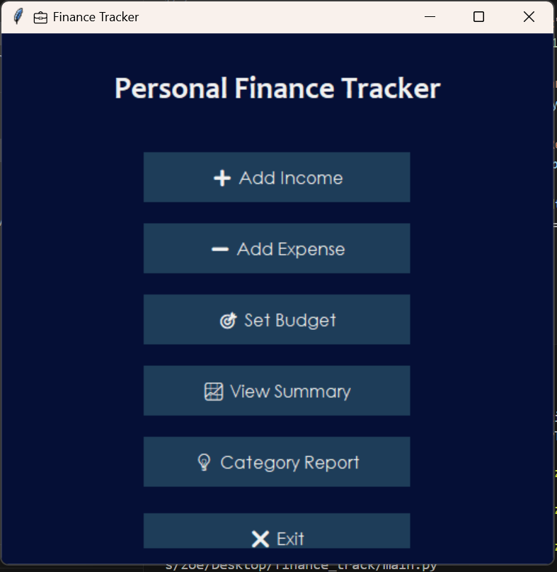
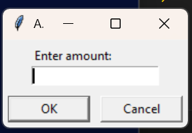
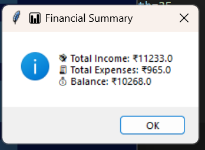
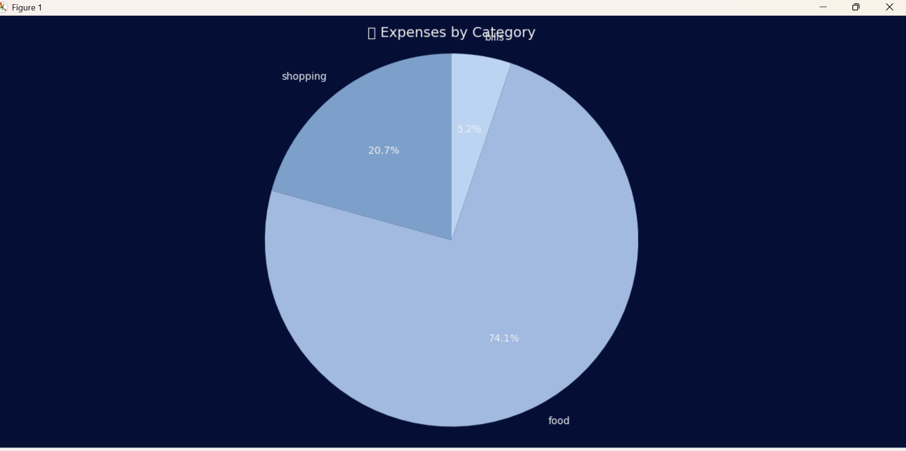

# Personal Finance Tracker

It is a simple yet powerful Personal Finance Tracker built using Python and Tkinter.  
This app helps users track their income, expenses, and savings through an intuitive and aesthetic GUI interface.

# Features

- ➕ Add income 
- ➕ Add expenses
- 📊 View summary of total income, expenses, and balance
- 🎨 Category-wise pie chart of expenses
- 🎯 Set budgets per category with automatic alerts

#  Tech Stack

- Python
- Tkinter (GUI)
- Matplotlib (Pie chart)
- CSV for data storage


# How to Run

1. Clone the repo or download the ZIP  
2. Make sure you have Python 3.10+ installed  
3. Install dependencies (if not already):
   ```bash
   pip install matplotlib

# Screenshots






# Project takeaways

Building GUI applications with Python

Handling real-world data with CSV

Visualizing information with Matplotlib

Creating intuitive and aesthetic user interfaces

File handling and data persistence